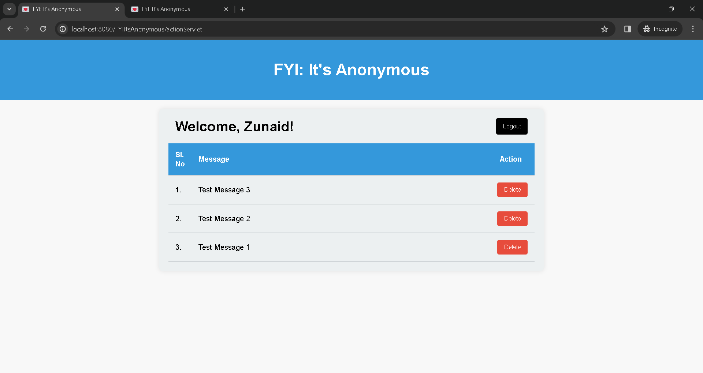

# FYI-Its-Anonymous
 

  

  <h3 align="center">FYI: It's Anonymous</h3>

  

    An Anonymous Feedback Application! :smile:
     
     
    <a href="https://github.com/zunaidhossain/FYI-Its-Anonymous">View Demo</a>
  

## About The Project

I have bulit this web application from scratch. I have implemented Java's JDBC, JSP, Servlet concepts in this project. 

Users can create register and can receive anonymous feedback from their friends and can also send anonymous feedback to thier friends by using their unique userId.
 
 
Homepage - Users can search userId to give anonymous feedback. 
 
 

 
 
Homepage - Users can give anonymous feedback after searching with userId. 
 
 

 
 
Register Page - Users can register with name and password. 
 
 

 
 
Success Page - After successful registartion this page is displayed with uniquely generated userId. 
 
 

 
 
Login Page - Users can login with userId and password. 
 
 

 
 
Dashboard - After logging in user can view the received messages in order of newest to oldest. 
 
 

 
 
Dashboard - Users can delete unecessary messages. 
 
 

 
 
Error Page - Custome Error Page. 
 
 

## Built With

* JAVA 
* JSP
* JDBC
* Servlet
* HTML
* CSS
* JavaScript

## Author

* **Zunaid Hossain** - *A Tech Enthusiast* - [Connect with me on LinkedIn](https://www.linkedin.com/in/zunaid-hossain-70b891235/)

